# <div align="center"><br>TUTORPRO.OS</div>

<div align="center">
  <p><strong>A Premium, Dark-Themed personal dashboard ecosystem designed specifically for private educators to manage student dossiers, track quick attendance, compile finance ledgers, and auto-generate student growth reports powered by Google Gemini AI.</strong></p>
  
  <p>Custom built for <strong>Arkadyuti Mandal</strong>.</p>
</div>

<div align="center">
  
  [](https://react.dev/)
  [](https://www.typescriptlang.org/)
  [](https://tailwindcss.com/)
  [](https://firebase.google.com/)
  [](https://ai.google.dev/)
  [](#-mobile-companion-app)
  
</div>

---

## 🎨 Interactive Gallery

<p align="center"><em>Scroll horizontally directly <strong>inside</strong> the browser and phone mockups below to cycle through the platform's interfaces.</em></p>

### 🖥️ Desktop Administration Console

<div style="background: #0b0f19; border-radius: 16px; border: 1px solid rgba(255, 255, 255, 0.08); overflow: hidden; box-shadow: 0 10px 25px -5px rgba(0, 0, 0, 0.3), 0 8px 10px -6px rgba(0, 0, 0, 0.3); display: flex; flex-direction: column; width: 100%; margin-bottom: 30px;">
  <!-- Browser Bar -->
  <div style="background: #0f1624; height: 36px; display: flex; align-items: center; padding: 0 14px; gap: 8px; border-bottom: 1px solid rgba(255, 255, 255, 0.05); user-select: none;">
    <div style="display: flex; gap: 5px;">
      <span style="width: 8px; height: 8px; border-radius: 50%; background: #ff5f56; display: inline-block;"></span>
      <span style="width: 8px; height: 8px; border-radius: 50%; background: #ffbd2e; display: inline-block;"></span>
      <span style="width: 8px; height: 8px; border-radius: 50%; background: #27c93f; display: inline-block;"></span>
    </div>
    <div style="flex-grow: 1; max-width: 320px; height: 20px; background: #1e293b; border-radius: 4px; margin-left: 14px; font-size: 10px; color: #64748b; display: flex; align-items: center; padding: 0 10px; font-family: monospace; letter-spacing: 0.03em; white-space: nowrap; overflow: hidden; text-overflow: ellipsis;">
      https://tutor-manager-liard.vercel.app/portal/dashboard
    </div>
  </div>
  
  <!-- Browser Screen Viewport -->
  <div style="display: flex; overflow-x: auto; gap: 20px; scroll-snap-type: x mandatory; padding: 20px; background: #0b0f19; -webkit-overflow-scrolling: touch;">

    <!-- Slide 1 -->
    <div style="flex: 0 0 85%; scroll-snap-align: start; box-sizing: border-box; display: flex; flex-direction: column; gap: 12px;">
      
      <div style="background: rgba(30, 41, 59, 0.45); border: 1px solid rgba(255, 255, 255, 0.08); border-radius: 12px; padding: 16px; display: flex; flex-direction: column; gap: 8px; text-align: left;">
        <div style="display: flex; justify-content: space-between; align-items: center;">
          <span style="font-size: 10px; font-weight: 700; text-transform: uppercase; letter-spacing: 0.05em; padding: 3px 8px; border-radius: 6px; background: rgba(99, 102, 241, 0.15); color: #a5b4fc; border: 1px solid rgba(99, 102, 241, 0.2); display: inline-block;">Desktop Portal</span>
          <span style="font-size: 11px; font-family: monospace; color: #64748b;">Module #01</span>
        </div>
        <h4 style="margin: 0; padding: 0; border: none; font-family: 'Outfit', sans-serif; font-size: 16px; font-weight: 600; color: #f8fafc; background: transparent;">Secure Login Portal</h4>
        <p style="margin: 0; padding: 0; border: none; font-size: 13px; color: #94a3b8; line-height: 1.45; background: transparent;">Clean authentication interface with secure credentials sign-in.</p>
        <div style="display: flex; gap: 6px; flex-wrap: wrap;">
          <span style="font-size: 10px; color: #06b6d4; background: rgba(6, 182, 212, 0.1); padding: 2px 6px; border-radius: 4px; border: 1px solid rgba(6, 182, 212, 0.15); display: inline-block;">#security</span>
          <span style="font-size: 10px; color: #06b6d4; background: rgba(6, 182, 212, 0.1); padding: 2px 6px; border-radius: 4px; border: 1px solid rgba(6, 182, 212, 0.15); display: inline-block;">#auth</span>
          <span style="font-size: 10px; color: #06b6d4; background: rgba(6, 182, 212, 0.1); padding: 2px 6px; border-radius: 4px; border: 1px solid rgba(6, 182, 212, 0.15); display: inline-block;">#login</span>
        </div>
      </div>
    </div>

    <!-- Slide 2 -->
    <div style="flex: 0 0 85%; scroll-snap-align: start; box-sizing: border-box; display: flex; flex-direction: column; gap: 12px;">
      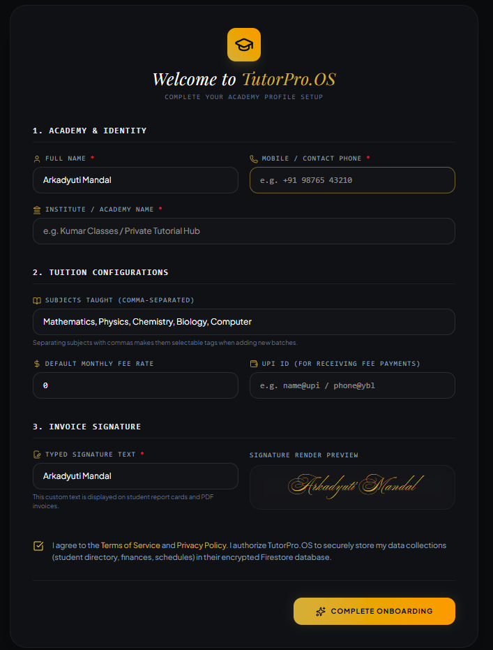
      <div style="background: rgba(30, 41, 59, 0.45); border: 1px solid rgba(255, 255, 255, 0.08); border-radius: 12px; padding: 16px; display: flex; flex-direction: column; gap: 8px; text-align: left;">
        <div style="display: flex; justify-content: space-between; align-items: center;">
          <span style="font-size: 10px; font-weight: 700; text-transform: uppercase; letter-spacing: 0.05em; padding: 3px 8px; border-radius: 6px; background: rgba(99, 102, 241, 0.15); color: #a5b4fc; border: 1px solid rgba(99, 102, 241, 0.2); display: inline-block;">Desktop Portal</span>
          <span style="font-size: 11px; font-family: monospace; color: #64748b;">Module #02</span>
        </div>
        <h4 style="margin: 0; padding: 0; border: none; font-family: 'Outfit', sans-serif; font-size: 16px; font-weight: 600; color: #f8fafc; background: transparent;">Guided Onboarding</h4>
        <p style="margin: 0; padding: 0; border: none; font-size: 13px; color: #94a3b8; line-height: 1.45; background: transparent;">Interactive configuration wizard to set up credentials and schedules.</p>
        <div style="display: flex; gap: 6px; flex-wrap: wrap;">
          <span style="font-size: 10px; color: #06b6d4; background: rgba(6, 182, 212, 0.1); padding: 2px 6px; border-radius: 4px; border: 1px solid rgba(6, 182, 212, 0.15); display: inline-block;">#setup</span>
          <span style="font-size: 10px; color: #06b6d4; background: rgba(6, 182, 212, 0.1); padding: 2px 6px; border-radius: 4px; border: 1px solid rgba(6, 182, 212, 0.15); display: inline-block;">#onboarding</span>
          <span style="font-size: 10px; color: #06b6d4; background: rgba(6, 182, 212, 0.1); padding: 2px 6px; border-radius: 4px; border: 1px solid rgba(6, 182, 212, 0.15); display: inline-block;">#wizard</span>
        </div>
      </div>
    </div>

    <!-- Slide 3 -->
    <div style="flex: 0 0 85%; scroll-snap-align: start; box-sizing: border-box; display: flex; flex-direction: column; gap: 12px;">
      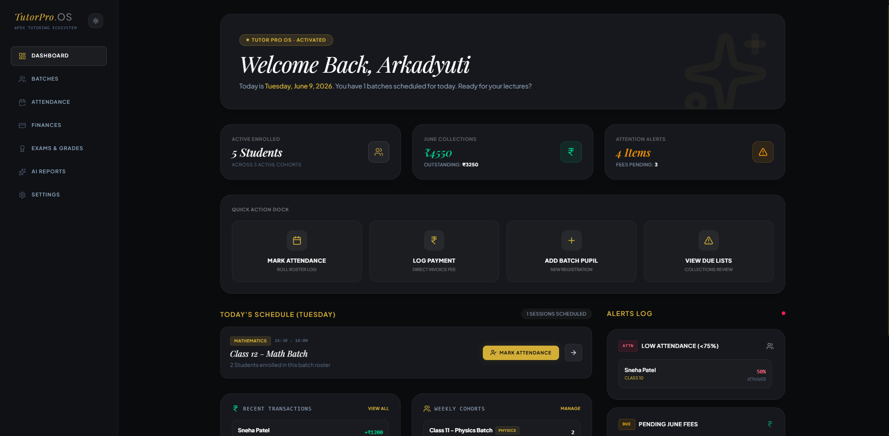
      <div style="background: rgba(30, 41, 59, 0.45); border: 1px solid rgba(255, 255, 255, 0.08); border-radius: 12px; padding: 16px; display: flex; flex-direction: column; gap: 8px; text-align: left;">
        <div style="display: flex; justify-content: space-between; align-items: center;">
          <span style="font-size: 10px; font-weight: 700; text-transform: uppercase; letter-spacing: 0.05em; padding: 3px 8px; border-radius: 6px; background: rgba(99, 102, 241, 0.15); color: #a5b4fc; border: 1px solid rgba(99, 102, 241, 0.2); display: inline-block;">Desktop Portal</span>
          <span style="font-size: 11px; font-family: monospace; color: #64748b;">Module #03</span>
        </div>
        <h4 style="margin: 0; padding: 0; border: none; font-family: 'Outfit', sans-serif; font-size: 16px; font-weight: 600; color: #f8fafc; background: transparent;">Analytics Dashboard</h4>
        <p style="margin: 0; padding: 0; border: none; font-size: 13px; color: #94a3b8; line-height: 1.45; background: transparent;">Real-time KPIs, active courses, pending tasks, and finances overview.</p>
        <div style="display: flex; gap: 6px; flex-wrap: wrap;">
          <span style="font-size: 10px; color: #06b6d4; background: rgba(6, 182, 212, 0.1); padding: 2px 6px; border-radius: 4px; border: 1px solid rgba(6, 182, 212, 0.15); display: inline-block;">#analytics</span>
          <span style="font-size: 10px; color: #06b6d4; background: rgba(6, 182, 212, 0.1); padding: 2px 6px; border-radius: 4px; border: 1px solid rgba(6, 182, 212, 0.15); display: inline-block;">#dashboard</span>
          <span style="font-size: 10px; color: #06b6d4; background: rgba(6, 182, 212, 0.1); padding: 2px 6px; border-radius: 4px; border: 1px solid rgba(6, 182, 212, 0.15); display: inline-block;">#overview</span>
        </div>
      </div>
    </div>

    <!-- Slide 4 -->
    <div style="flex: 0 0 85%; scroll-snap-align: start; box-sizing: border-box; display: flex; flex-direction: column; gap: 12px;">
      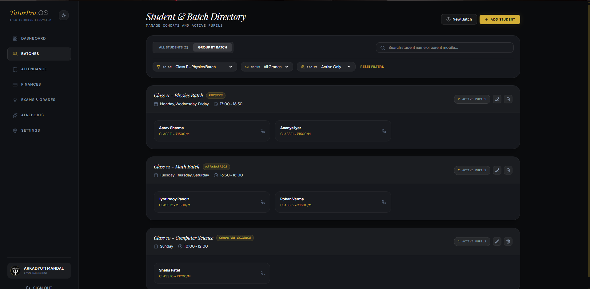
      <div style="background: rgba(30, 41, 59, 0.45); border: 1px solid rgba(255, 255, 255, 0.08); border-radius: 12px; padding: 16px; display: flex; flex-direction: column; gap: 8px; text-align: left;">
        <div style="display: flex; justify-content: space-between; align-items: center;">
          <span style="font-size: 10px; font-weight: 700; text-transform: uppercase; letter-spacing: 0.05em; padding: 3px 8px; border-radius: 6px; background: rgba(99, 102, 241, 0.15); color: #a5b4fc; border: 1px solid rgba(99, 102, 241, 0.2); display: inline-block;">Desktop Portal</span>
          <span style="font-size: 11px; font-family: monospace; color: #64748b;">Module #04</span>
        </div>
        <h4 style="margin: 0; padding: 0; border: none; font-family: 'Outfit', sans-serif; font-size: 16px; font-weight: 600; color: #f8fafc; background: transparent;">Batch Management</h4>
        <p style="margin: 0; padding: 0; border: none; font-size: 13px; color: #94a3b8; line-height: 1.45; background: transparent;">Monitor academic cohorts, assign teachers, allocate rooms, and track size.</p>
        <div style="display: flex; gap: 6px; flex-wrap: wrap;">
          <span style="font-size: 10px; color: #06b6d4; background: rgba(6, 182, 212, 0.1); padding: 2px 6px; border-radius: 4px; border: 1px solid rgba(6, 182, 212, 0.15); display: inline-block;">#batches</span>
          <span style="font-size: 10px; color: #06b6d4; background: rgba(6, 182, 212, 0.1); padding: 2px 6px; border-radius: 4px; border: 1px solid rgba(6, 182, 212, 0.15); display: inline-block;">#courses</span>
          <span style="font-size: 10px; color: #06b6d4; background: rgba(6, 182, 212, 0.1); padding: 2px 6px; border-radius: 4px; border: 1px solid rgba(6, 182, 212, 0.15); display: inline-block;">#scheduler</span>
        </div>
      </div>
    </div>

    <!-- Slide 5 -->
    <div style="flex: 0 0 85%; scroll-snap-align: start; box-sizing: border-box; display: flex; flex-direction: column; gap: 12px;">
      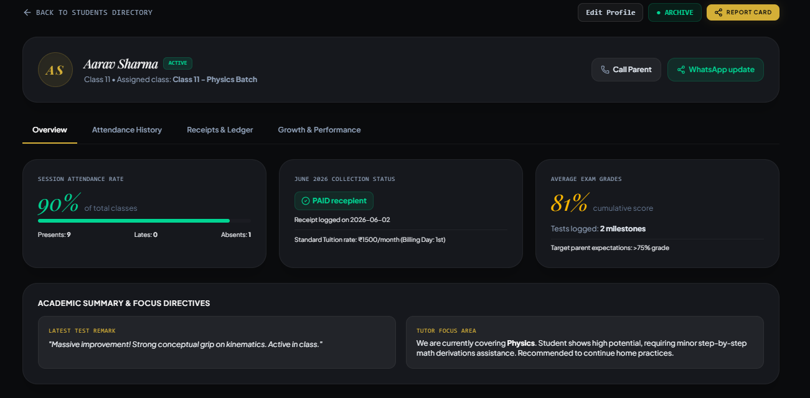
      <div style="background: rgba(30, 41, 59, 0.45); border: 1px solid rgba(255, 255, 255, 0.08); border-radius: 12px; padding: 16px; display: flex; flex-direction: column; gap: 8px; text-align: left;">
        <div style="display: flex; justify-content: space-between; align-items: center;">
          <span style="font-size: 10px; font-weight: 700; text-transform: uppercase; letter-spacing: 0.05em; padding: 3px 8px; border-radius: 6px; background: rgba(99, 102, 241, 0.15); color: #a5b4fc; border: 1px solid rgba(99, 102, 241, 0.2); display: inline-block;">Desktop Portal</span>
          <span style="font-size: 11px; font-family: monospace; color: #64748b;">Module #05</span>
        </div>
        <h4 style="margin: 0; padding: 0; border: none; font-family: 'Outfit', sans-serif; font-size: 16px; font-weight: 600; color: #f8fafc; background: transparent;">Student Profile Hub</h4>
        <p style="margin: 0; padding: 0; border: none; font-size: 13px; color: #94a3b8; line-height: 1.45; background: transparent;">Comprehensive database record of student academic histories and registration.</p>
        <div style="display: flex; gap: 6px; flex-wrap: wrap;">
          <span style="font-size: 10px; color: #06b6d4; background: rgba(6, 182, 212, 0.1); padding: 2px 6px; border-radius: 4px; border: 1px solid rgba(6, 182, 212, 0.15); display: inline-block;">#profile</span>
          <span style="font-size: 10px; color: #06b6d4; background: rgba(6, 182, 212, 0.1); padding: 2px 6px; border-radius: 4px; border: 1px solid rgba(6, 182, 212, 0.15); display: inline-block;">#student</span>
          <span style="font-size: 10px; color: #06b6d4; background: rgba(6, 182, 212, 0.1); padding: 2px 6px; border-radius: 4px; border: 1px solid rgba(6, 182, 212, 0.15); display: inline-block;">#records</span>
        </div>
      </div>
    </div>

    <!-- Slide 6 -->
    <div style="flex: 0 0 85%; scroll-snap-align: start; box-sizing: border-box; display: flex; flex-direction: column; gap: 12px;">
      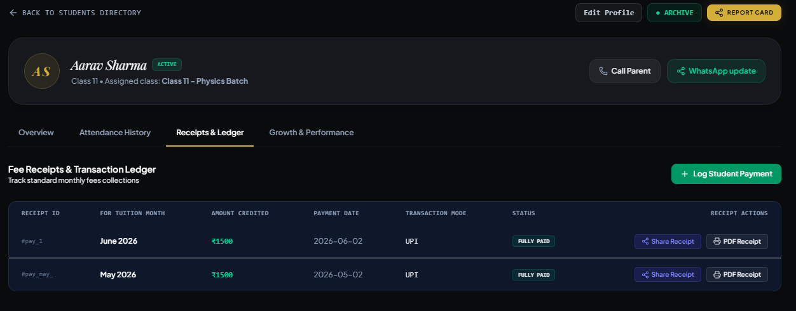
      <div style="background: rgba(30, 41, 59, 0.45); border: 1px solid rgba(255, 255, 255, 0.08); border-radius: 12px; padding: 16px; display: flex; flex-direction: column; gap: 8px; text-align: left;">
        <div style="display: flex; justify-content: space-between; align-items: center;">
          <span style="font-size: 10px; font-weight: 700; text-transform: uppercase; letter-spacing: 0.05em; padding: 3px 8px; border-radius: 6px; background: rgba(99, 102, 241, 0.15); color: #a5b4fc; border: 1px solid rgba(99, 102, 241, 0.2); display: inline-block;">Desktop Portal</span>
          <span style="font-size: 11px; font-family: monospace; color: #64748b;">Module #06</span>
        </div>
        <h4 style="margin: 0; padding: 0; border: none; font-family: 'Outfit', sans-serif; font-size: 16px; font-weight: 600; color: #f8fafc; background: transparent;">Dossier Ledger</h4>
        <p style="margin: 0; padding: 0; border: none; font-size: 13px; color: #94a3b8; line-height: 1.45; background: transparent;">Detailed administrative documentation system for student dossiers.</p>
        <div style="display: flex; gap: 6px; flex-wrap: wrap;">
          <span style="font-size: 10px; color: #06b6d4; background: rgba(6, 182, 212, 0.1); padding: 2px 6px; border-radius: 4px; border: 1px solid rgba(6, 182, 212, 0.15); display: inline-block;">#dossier</span>
          <span style="font-size: 10px; color: #06b6d4; background: rgba(6, 182, 212, 0.1); padding: 2px 6px; border-radius: 4px; border: 1px solid rgba(6, 182, 212, 0.15); display: inline-block;">#ledger</span>
          <span style="font-size: 10px; color: #06b6d4; background: rgba(6, 182, 212, 0.1); padding: 2px 6px; border-radius: 4px; border: 1px solid rgba(6, 182, 212, 0.15); display: inline-block;">#charts</span>
        </div>
      </div>
    </div>

    <!-- Slide 7 -->
    <div style="flex: 0 0 85%; scroll-snap-align: start; box-sizing: border-box; display: flex; flex-direction: column; gap: 12px;">
      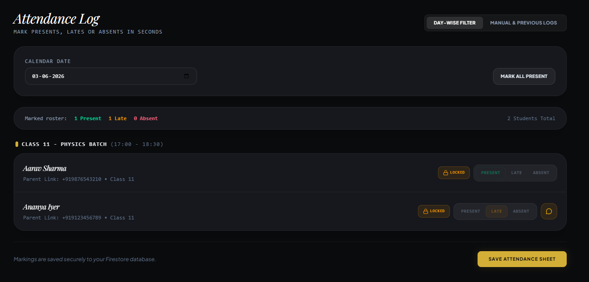
      <div style="background: rgba(30, 41, 59, 0.45); border: 1px solid rgba(255, 255, 255, 0.08); border-radius: 12px; padding: 16px; display: flex; flex-direction: column; gap: 8px; text-align: left;">
        <div style="display: flex; justify-content: space-between; align-items: center;">
          <span style="font-size: 10px; font-weight: 700; text-transform: uppercase; letter-spacing: 0.05em; padding: 3px 8px; border-radius: 6px; background: rgba(99, 102, 241, 0.15); color: #a5b4fc; border: 1px solid rgba(99, 102, 241, 0.2); display: inline-block;">Desktop Portal</span>
          <span style="font-size: 11px; font-family: monospace; color: #64748b;">Module #07</span>
        </div>
        <h4 style="margin: 0; padding: 0; border: none; font-family: 'Outfit', sans-serif; font-size: 16px; font-weight: 600; color: #f8fafc; background: transparent;">Attendance Manager</h4>
        <p style="margin: 0; padding: 0; border: none; font-size: 13px; color: #94a3b8; line-height: 1.45; background: transparent;">Automated roll call check verification with attendance statistics.</p>
        <div style="display: flex; gap: 6px; flex-wrap: wrap;">
          <span style="font-size: 10px; color: #06b6d4; background: rgba(6, 182, 212, 0.1); padding: 2px 6px; border-radius: 4px; border: 1px solid rgba(6, 182, 212, 0.15); display: inline-block;">#attendance</span>
          <span style="font-size: 10px; color: #06b6d4; background: rgba(6, 182, 212, 0.1); padding: 2px 6px; border-radius: 4px; border: 1px solid rgba(6, 182, 212, 0.15); display: inline-block;">#analytics</span>
          <span style="font-size: 10px; color: #06b6d4; background: rgba(6, 182, 212, 0.1); padding: 2px 6px; border-radius: 4px; border: 1px solid rgba(6, 182, 212, 0.15); display: inline-block;">#tracking</span>
        </div>
      </div>
    </div>

    <!-- Slide 8 -->
    <div style="flex: 0 0 85%; scroll-snap-align: start; box-sizing: border-box; display: flex; flex-direction: column; gap: 12px;">
      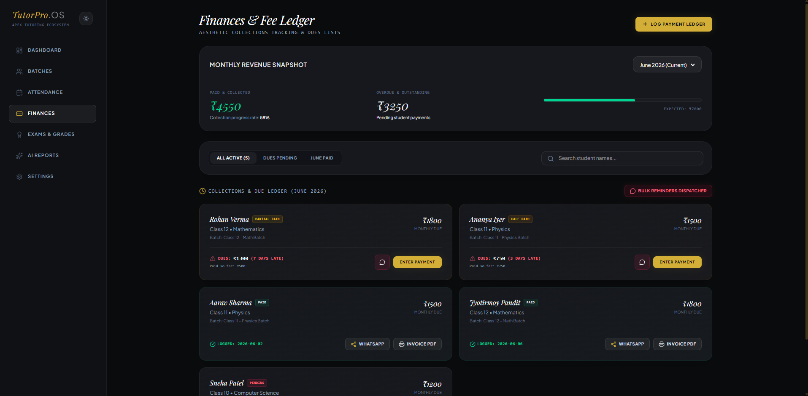
      <div style="background: rgba(30, 41, 59, 0.45); border: 1px solid rgba(255, 255, 255, 0.08); border-radius: 12px; padding: 16px; display: flex; flex-direction: column; gap: 8px; text-align: left;">
        <div style="display: flex; justify-content: space-between; align-items: center;">
          <span style="font-size: 10px; font-weight: 700; text-transform: uppercase; letter-spacing: 0.05em; padding: 3px 8px; border-radius: 6px; background: rgba(99, 102, 241, 0.15); color: #a5b4fc; border: 1px solid rgba(99, 102, 241, 0.2); display: inline-block;">Desktop Portal</span>
          <span style="font-size: 11px; font-family: monospace; color: #64748b;">Module #08</span>
        </div>
        <h4 style="margin: 0; padding: 0; border: none; font-family: 'Outfit', sans-serif; font-size: 16px; font-weight: 600; color: #f8fafc; background: transparent;">Financial Console</h4>
        <p style="margin: 0; padding: 0; border: none; font-size: 13px; color: #94a3b8; line-height: 1.45; background: transparent;">Fee collection tracking, payment statements, and accounting ledgers.</p>
        <div style="display: flex; gap: 6px; flex-wrap: wrap;">
          <span style="font-size: 10px; color: #06b6d4; background: rgba(6, 182, 212, 0.1); padding: 2px 6px; border-radius: 4px; border: 1px solid rgba(6, 182, 212, 0.15); display: inline-block;">#finances</span>
          <span style="font-size: 10px; color: #06b6d4; background: rgba(6, 182, 212, 0.1); padding: 2px 6px; border-radius: 4px; border: 1px solid rgba(6, 182, 212, 0.15); display: inline-block;">#accounting</span>
          <span style="font-size: 10px; color: #06b6d4; background: rgba(6, 182, 212, 0.1); padding: 2px 6px; border-radius: 4px; border: 1px solid rgba(6, 182, 212, 0.15); display: inline-block;">#billing</span>
        </div>
      </div>
    </div>

    <!-- Slide 9 -->
    <div style="flex: 0 0 85%; scroll-snap-align: start; box-sizing: border-box; display: flex; flex-direction: column; gap: 12px;">
      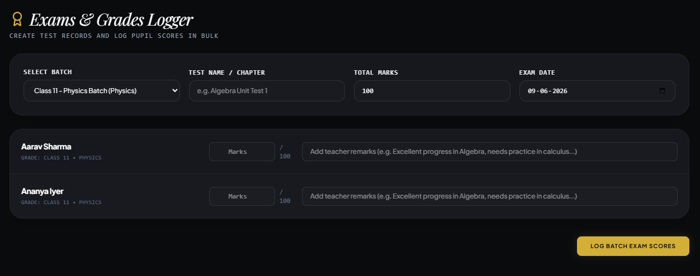
      <div style="background: rgba(30, 41, 59, 0.45); border: 1px solid rgba(255, 255, 255, 0.08); border-radius: 12px; padding: 16px; display: flex; flex-direction: column; gap: 8px; text-align: left;">
        <div style="display: flex; justify-content: space-between; align-items: center;">
          <span style="font-size: 10px; font-weight: 700; text-transform: uppercase; letter-spacing: 0.05em; padding: 3px 8px; border-radius: 6px; background: rgba(99, 102, 241, 0.15); color: #a5b4fc; border: 1px solid rgba(99, 102, 241, 0.2); display: inline-block;">Desktop Portal</span>
          <span style="font-size: 11px; font-family: monospace; color: #64748b;">Module #09</span>
        </div>
        <h4 style="margin: 0; padding: 0; border: none; font-family: 'Outfit', sans-serif; font-size: 16px; font-weight: 600; color: #f8fafc; background: transparent;">Exams & Grading</h4>
        <p style="margin: 0; padding: 0; border: none; font-size: 13px; color: #94a3b8; line-height: 1.45; background: transparent;">Academic examinations setup, scheduling, and digital report cards.</p>
        <div style="display: flex; gap: 6px; flex-wrap: wrap;">
          <span style="font-size: 10px; color: #06b6d4; background: rgba(6, 182, 212, 0.1); padding: 2px 6px; border-radius: 4px; border: 1px solid rgba(6, 182, 212, 0.15); display: inline-block;">#exams</span>
          <span style="font-size: 10px; color: #06b6d4; background: rgba(6, 182, 212, 0.1); padding: 2px 6px; border-radius: 4px; border: 1px solid rgba(6, 182, 212, 0.15); display: inline-block;">#grades</span>
          <span style="font-size: 10px; color: #06b6d4; background: rgba(6, 182, 212, 0.1); padding: 2px 6px; border-radius: 4px; border: 1px solid rgba(6, 182, 212, 0.15); display: inline-block;">#evaluation</span>
        </div>
      </div>
    </div>

    <!-- Slide 10 -->
    <div style="flex: 0 0 85%; scroll-snap-align: start; box-sizing: border-box; display: flex; flex-direction: column; gap: 12px;">
      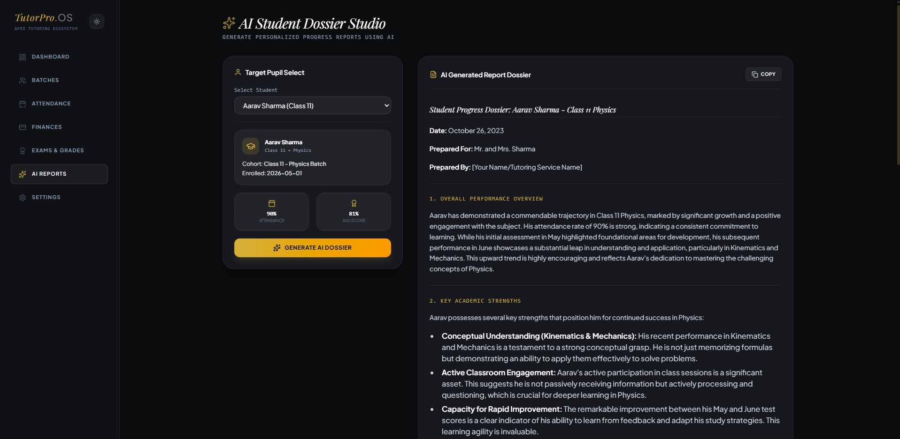
      <div style="background: rgba(30, 41, 59, 0.45); border: 1px solid rgba(255, 255, 255, 0.08); border-radius: 12px; padding: 16px; display: flex; flex-direction: column; gap: 8px; text-align: left;">
        <div style="display: flex; justify-content: space-between; align-items: center;">
          <span style="font-size: 10px; font-weight: 700; text-transform: uppercase; letter-spacing: 0.05em; padding: 3px 8px; border-radius: 6px; background: rgba(99, 102, 241, 0.15); color: #a5b4fc; border: 1px solid rgba(99, 102, 241, 0.2); display: inline-block;">Desktop Portal</span>
          <span style="font-size: 11px; font-family: monospace; color: #64748b;">Module #10</span>
        </div>
        <h4 style="margin: 0; padding: 0; border: none; font-family: 'Outfit', sans-serif; font-size: 16px; font-weight: 600; color: #f8fafc; background: transparent;">AI Reports Engine</h4>
        <p style="margin: 0; padding: 0; border: none; font-size: 13px; color: #94a3b8; line-height: 1.45; background: transparent;">Automated analysis tool generating student behavioral logs and forecasts.</p>
        <div style="display: flex; gap: 6px; flex-wrap: wrap;">
          <span style="font-size: 10px; color: #06b6d4; background: rgba(6, 182, 212, 0.1); padding: 2px 6px; border-radius: 4px; border: 1px solid rgba(6, 182, 212, 0.15); display: inline-block;">#ai</span>
          <span style="font-size: 10px; color: #06b6d4; background: rgba(6, 182, 212, 0.1); padding: 2px 6px; border-radius: 4px; border: 1px solid rgba(6, 182, 212, 0.15); display: inline-block;">#reports</span>
          <span style="font-size: 10px; color: #06b6d4; background: rgba(6, 182, 212, 0.1); padding: 2px 6px; border-radius: 4px; border: 1px solid rgba(6, 182, 212, 0.15); display: inline-block;">#insights</span>
        </div>
      </div>
    </div>

    <!-- Slide 11 -->
    <div style="flex: 0 0 85%; scroll-snap-align: start; box-sizing: border-box; display: flex; flex-direction: column; gap: 12px;">
      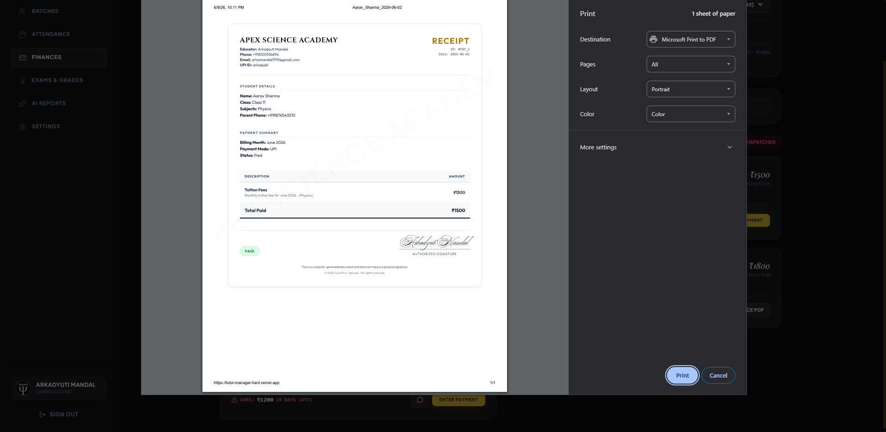
      <div style="background: rgba(30, 41, 59, 0.45); border: 1px solid rgba(255, 255, 255, 0.08); border-radius: 12px; padding: 16px; display: flex; flex-direction: column; gap: 8px; text-align: left;">
        <div style="display: flex; justify-content: space-between; align-items: center;">
          <span style="font-size: 10px; font-weight: 700; text-transform: uppercase; letter-spacing: 0.05em; padding: 3px 8px; border-radius: 6px; background: rgba(99, 102, 241, 0.15); color: #a5b4fc; border: 1px solid rgba(99, 102, 241, 0.2); display: inline-block;">Desktop Portal</span>
          <span style="font-size: 11px; font-family: monospace; color: #64748b;">Module #11</span>
        </div>
        <h4 style="margin: 0; padding: 0; border: none; font-family: 'Outfit', sans-serif; font-size: 16px; font-weight: 600; color: #f8fafc; background: transparent;">Invoice & Receipting</h4>
        <p style="margin: 0; padding: 0; border: none; font-size: 13px; color: #94a3b8; line-height: 1.45; background: transparent;">Generates receipt logs and downloadable printable invoice PDFs.</p>
        <div style="display: flex; gap: 6px; flex-wrap: wrap;">
          <span style="font-size: 10px; color: #06b6d4; background: rgba(6, 182, 212, 0.1); padding: 2px 6px; border-radius: 4px; border: 1px solid rgba(6, 182, 212, 0.15); display: inline-block;">#invoice</span>
          <span style="font-size: 10px; color: #06b6d4; background: rgba(6, 182, 212, 0.1); padding: 2px 6px; border-radius: 4px; border: 1px solid rgba(6, 182, 212, 0.15); display: inline-block;">#receipt</span>
          <span style="font-size: 10px; color: #06b6d4; background: rgba(6, 182, 212, 0.1); padding: 2px 6px; border-radius: 4px; border: 1px solid rgba(6, 182, 212, 0.15); display: inline-block;">#billing</span>
        </div>
      </div>
    </div>

  </div>
</div>

### 📱 Mobile Companion App

<div style="display: flex; justify-content: center; margin-bottom: 40px;">
  <!-- Phone Shell Mockup -->
  <div style="border: 7px solid #1e293b; border-radius: 36px; overflow: hidden; background: #0b0f19; width: 310px; box-shadow: 0 10px 25px -5px rgba(0, 0, 0, 0.3), 0 8px 10px -6px rgba(0, 0, 0, 0.3); position: relative; padding: 10px 10px 10px 10px;">
    <!-- Top Notch -->
    <div style="width: 100px; height: 14px; background: #1e293b; border-bottom-left-radius: 10px; border-bottom-right-radius: 10px; position: absolute; top: 0; left: 50%; transform: translateX(-50%); z-index: 10;"></div>
    
    <!-- Phone Screen Viewport -->
    <div style="display: flex; overflow-x: auto; gap: 15px; scroll-snap-type: x mandatory; background: #0b0f19; -webkit-overflow-scrolling: touch; border-radius: 26px; width: 100%; height: 580px; padding-top: 10px;">

      <!-- Slide 1 -->
      <div style="flex: 0 0 100%; scroll-snap-align: start; box-sizing: border-box; display: flex; flex-direction: column; gap: 12px; height: 100%; padding: 10px; text-align: left;">
        <div style="flex-grow: 1; height: 380px; display: flex; align-items: center; justify-content: center; overflow: hidden; border-radius: 12px; border: 1px solid rgba(255, 255, 255, 0.08);">
          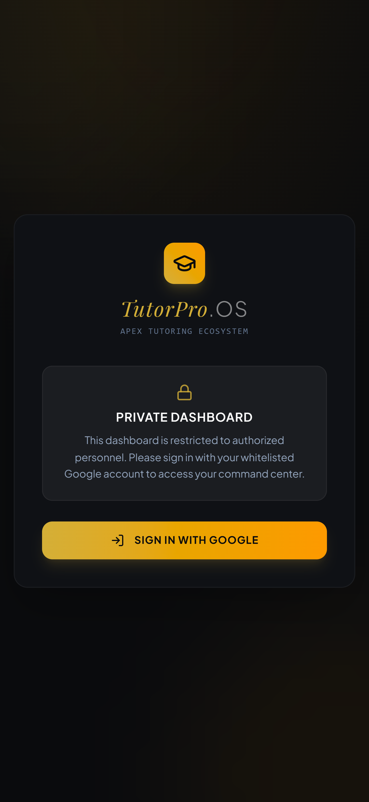
        </div>
        <div style="background: rgba(30, 41, 59, 0.45); border: 1px solid rgba(255, 255, 255, 0.08); border-radius: 12px; padding: 12px; display: flex; flex-direction: column; gap: 6px; min-height: 120px;">
          <div style="display: flex; justify-content: space-between; align-items: center;">
            <span style="font-size: 9px; font-weight: 700; text-transform: uppercase; letter-spacing: 0.05em; padding: 2px 6px; border-radius: 4px; background: rgba(6, 182, 212, 0.15); color: #8be9fd; border: 1px solid rgba(6, 182, 212, 0.2); display: inline-block;">Mobile App</span>
            <span style="font-size: 10px; font-family: monospace; color: #64748b;">Module #01</span>
          </div>
          <h4 style="margin: 0; padding: 0; border: none; font-family: 'Outfit', sans-serif; font-size: 14px; font-weight: 600; color: #f8fafc; background: transparent;">Secure Login Portal</h4>
          <p style="margin: 0; padding: 0; border: none; font-size: 11px; color: #94a3b8; line-height: 1.4; background: transparent;">Clean authentication interface with secure credentials sign-in.</p>
          <div style="display: flex; gap: 4px; flex-wrap: wrap;">
            <span style="font-size: 9px; color: #06b6d4; background: rgba(6, 182, 212, 0.1); padding: 1px 6px; border-radius: 3px; border: 1px solid rgba(6, 182, 212, 0.15); display: inline-block;">#security</span>
            <span style="font-size: 9px; color: #06b6d4; background: rgba(6, 182, 212, 0.1); padding: 1px 6px; border-radius: 3px; border: 1px solid rgba(6, 182, 212, 0.15); display: inline-block;">#auth</span>
          </div>
        </div>
      </div>

      <!-- Slide 2 -->
      <div style="flex: 0 0 100%; scroll-snap-align: start; box-sizing: border-box; display: flex; flex-direction: column; gap: 12px; height: 100%; padding: 10px; text-align: left;">
        <div style="flex-grow: 1; height: 380px; display: flex; align-items: center; justify-content: center; overflow: hidden; border-radius: 12px; border: 1px solid rgba(255, 255, 255, 0.08);">
          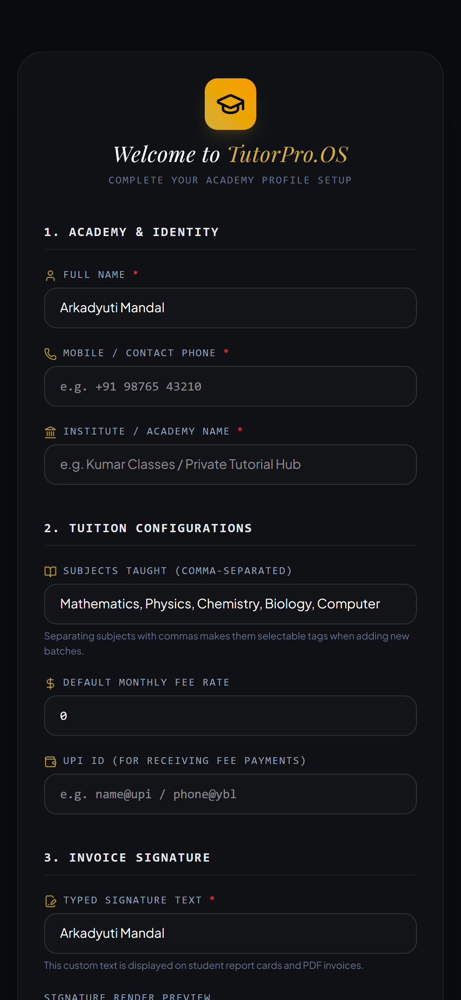
        </div>
        <div style="background: rgba(30, 41, 59, 0.45); border: 1px solid rgba(255, 255, 255, 0.08); border-radius: 12px; padding: 12px; display: flex; flex-direction: column; gap: 6px; min-height: 120px;">
          <div style="display: flex; justify-content: space-between; align-items: center;">
            <span style="font-size: 9px; font-weight: 700; text-transform: uppercase; letter-spacing: 0.05em; padding: 2px 6px; border-radius: 4px; background: rgba(6, 182, 212, 0.15); color: #8be9fd; border: 1px solid rgba(6, 182, 212, 0.2); display: inline-block;">Mobile App</span>
            <span style="font-size: 10px; font-family: monospace; color: #64748b;">Module #02</span>
          </div>
          <h4 style="margin: 0; padding: 0; border: none; font-family: 'Outfit', sans-serif; font-size: 14px; font-weight: 600; color: #f8fafc; background: transparent;">Guided Onboarding</h4>
          <p style="margin: 0; padding: 0; border: none; font-size: 11px; color: #94a3b8; line-height: 1.4; background: transparent;">Interactive configuration wizard to set up credentials and schedules.</p>
          <div style="display: flex; gap: 4px; flex-wrap: wrap;">
            <span style="font-size: 9px; color: #06b6d4; background: rgba(6, 182, 212, 0.1); padding: 1px 6px; border-radius: 3px; border: 1px solid rgba(6, 182, 212, 0.15); display: inline-block;">#setup</span>
            <span style="font-size: 9px; color: #06b6d4; background: rgba(6, 182, 212, 0.1); padding: 1px 6px; border-radius: 3px; border: 1px solid rgba(6, 182, 212, 0.15); display: inline-block;">#onboarding</span>
          </div>
        </div>
      </div>

      <!-- Slide 3 -->
      <div style="flex: 0 0 100%; scroll-snap-align: start; box-sizing: border-box; display: flex; flex-direction: column; gap: 12px; height: 100%; padding: 10px; text-align: left;">
        <div style="flex-grow: 1; height: 380px; display: flex; align-items: center; justify-content: center; overflow: hidden; border-radius: 12px; border: 1px solid rgba(255, 255, 255, 0.08);">
          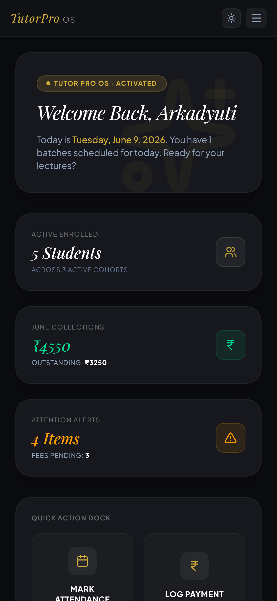
        </div>
        <div style="background: rgba(30, 41, 59, 0.45); border: 1px solid rgba(255, 255, 255, 0.08); border-radius: 12px; padding: 12px; display: flex; flex-direction: column; gap: 6px; min-height: 120px;">
          <div style="display: flex; justify-content: space-between; align-items: center;">
            <span style="font-size: 9px; font-weight: 700; text-transform: uppercase; letter-spacing: 0.05em; padding: 2px 6px; border-radius: 4px; background: rgba(6, 182, 212, 0.15); color: #8be9fd; border: 1px solid rgba(6, 182, 212, 0.2); display: inline-block;">Mobile App</span>
            <span style="font-size: 10px; font-family: monospace; color: #64748b;">Module #03</span>
          </div>
          <h4 style="margin: 0; padding: 0; border: none; font-family: 'Outfit', sans-serif; font-size: 14px; font-weight: 600; color: #f8fafc; background: transparent;">Analytics Dashboard</h4>
          <p style="margin: 0; padding: 0; border: none; font-size: 11px; color: #94a3b8; line-height: 1.4; background: transparent;">Real-time KPIs, active courses, pending tasks, and finances overview.</p>
          <div style="display: flex; gap: 4px; flex-wrap: wrap;">
            <span style="font-size: 9px; color: #06b6d4; background: rgba(6, 182, 212, 0.1); padding: 1px 6px; border-radius: 3px; border: 1px solid rgba(6, 182, 212, 0.15); display: inline-block;">#analytics</span>
            <span style="font-size: 9px; color: #06b6d4; background: rgba(6, 182, 212, 0.1); padding: 1px 6px; border-radius: 3px; border: 1px solid rgba(6, 182, 212, 0.15); display: inline-block;">#dashboard</span>
          </div>
        </div>
      </div>

      <!-- Slide 4 -->
      <div style="flex: 0 0 100%; scroll-snap-align: start; box-sizing: border-box; display: flex; flex-direction: column; gap: 12px; height: 100%; padding: 10px; text-align: left;">
        <div style="flex-grow: 1; height: 380px; display: flex; align-items: center; justify-content: center; overflow: hidden; border-radius: 12px; border: 1px solid rgba(255, 255, 255, 0.08);">
          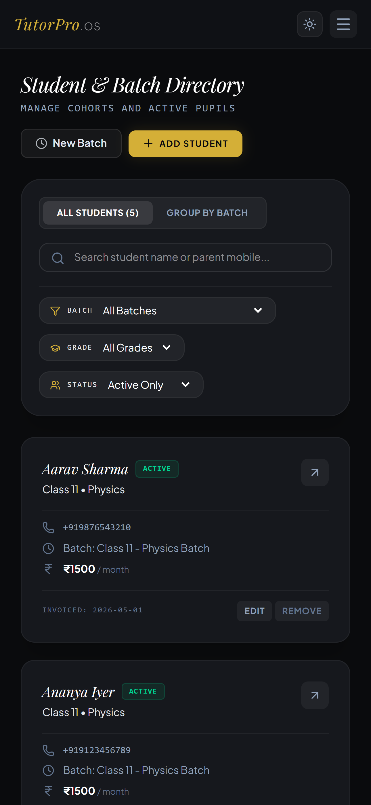
        </div>
        <div style="background: rgba(30, 41, 59, 0.45); border: 1px solid rgba(255, 255, 255, 0.08); border-radius: 12px; padding: 12px; display: flex; flex-direction: column; gap: 6px; min-height: 120px;">
          <div style="display: flex; justify-content: space-between; align-items: center;">
            <span style="font-size: 9px; font-weight: 700; text-transform: uppercase; letter-spacing: 0.05em; padding: 2px 6px; border-radius: 4px; background: rgba(6, 182, 212, 0.15); color: #8be9fd; border: 1px solid rgba(6, 182, 212, 0.2); display: inline-block;">Mobile App</span>
            <span style="font-size: 10px; font-family: monospace; color: #64748b;">Module #04</span>
          </div>
          <h4 style="margin: 0; padding: 0; border: none; font-family: 'Outfit', sans-serif; font-size: 14px; font-weight: 600; color: #f8fafc; background: transparent;">Batch Management</h4>
          <p style="margin: 0; padding: 0; border: none; font-size: 11px; color: #94a3b8; line-height: 1.4; background: transparent;">Monitor academic cohorts, assign teachers, allocate rooms, and track size.</p>
          <div style="display: flex; gap: 4px; flex-wrap: wrap;">
            <span style="font-size: 9px; color: #06b6d4; background: rgba(6, 182, 212, 0.1); padding: 1px 6px; border-radius: 3px; border: 1px solid rgba(6, 182, 212, 0.15); display: inline-block;">#batches</span>
            <span style="font-size: 9px; color: #06b6d4; background: rgba(6, 182, 212, 0.1); padding: 1px 6px; border-radius: 3px; border: 1px solid rgba(6, 182, 212, 0.15); display: inline-block;">#courses</span>
          </div>
        </div>
      </div>

      <!-- Slide 5 -->
      <div style="flex: 0 0 100%; scroll-snap-align: start; box-sizing: border-box; display: flex; flex-direction: column; gap: 12px; height: 100%; padding: 10px; text-align: left;">
        <div style="flex-grow: 1; height: 380px; display: flex; align-items: center; justify-content: center; overflow: hidden; border-radius: 12px; border: 1px solid rgba(255, 255, 255, 0.08);">
          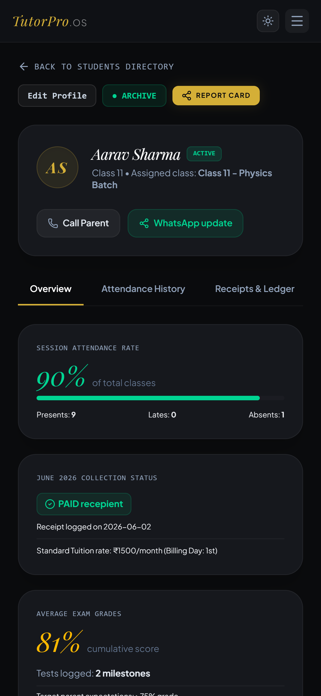
        </div>
        <div style="background: rgba(30, 41, 59, 0.45); border: 1px solid rgba(255, 255, 255, 0.08); border-radius: 12px; padding: 12px; display: flex; flex-direction: column; gap: 6px; min-height: 120px;">
          <div style="display: flex; justify-content: space-between; align-items: center;">
            <span style="font-size: 9px; font-weight: 700; text-transform: uppercase; letter-spacing: 0.05em; padding: 2px 6px; border-radius: 4px; background: rgba(6, 182, 212, 0.15); color: #8be9fd; border: 1px solid rgba(6, 182, 212, 0.2); display: inline-block;">Mobile App</span>
            <span style="font-size: 10px; font-family: monospace; color: #64748b;">Module #05</span>
          </div>
          <h4 style="margin: 0; padding: 0; border: none; font-family: 'Outfit', sans-serif; font-size: 14px; font-weight: 600; color: #f8fafc; background: transparent;">Student Profile Hub</h4>
          <p style="margin: 0; padding: 0; border: none; font-size: 11px; color: #94a3b8; line-height: 1.4; background: transparent;">Comprehensive database record of student academic histories and registration.</p>
          <div style="display: flex; gap: 4px; flex-wrap: wrap;">
            <span style="font-size: 9px; color: #06b6d4; background: rgba(6, 182, 212, 0.1); padding: 1px 6px; border-radius: 3px; border: 1px solid rgba(6, 182, 212, 0.15); display: inline-block;">#profile</span>
            <span style="font-size: 9px; color: #06b6d4; background: rgba(6, 182, 212, 0.1); padding: 1px 6px; border-radius: 3px; border: 1px solid rgba(6, 182, 212, 0.15); display: inline-block;">#student</span>
          </div>
        </div>
      </div>

      <!-- Slide 6 -->
      <div style="flex: 0 0 100%; scroll-snap-align: start; box-sizing: border-box; display: flex; flex-direction: column; gap: 12px; height: 100%; padding: 10px; text-align: left;">
        <div style="flex-grow: 1; height: 380px; display: flex; align-items: center; justify-content: center; overflow: hidden; border-radius: 12px; border: 1px solid rgba(255, 255, 255, 0.08);">
          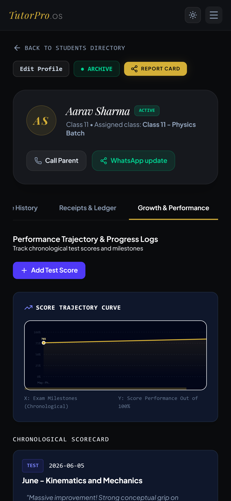
        </div>
        <div style="background: rgba(30, 41, 59, 0.45); border: 1px solid rgba(255, 255, 255, 0.08); border-radius: 12px; padding: 12px; display: flex; flex-direction: column; gap: 6px; min-height: 120px;">
          <div style="display: flex; justify-content: space-between; align-items: center;">
            <span style="font-size: 9px; font-weight: 700; text-transform: uppercase; letter-spacing: 0.05em; padding: 2px 6px; border-radius: 4px; background: rgba(6, 182, 212, 0.15); color: #8be9fd; border: 1px solid rgba(6, 182, 212, 0.2); display: inline-block;">Mobile App</span>
            <span style="font-size: 10px; font-family: monospace; color: #64748b;">Module #06</span>
          </div>
          <h4 style="margin: 0; padding: 0; border: none; font-family: 'Outfit', sans-serif; font-size: 14px; font-weight: 600; color: #f8fafc; background: transparent;">Dossier Ledger</h4>
          <p style="margin: 0; padding: 0; border: none; font-size: 11px; color: #94a3b8; line-height: 1.4; background: transparent;">Detailed administrative documentation system for student dossiers.</p>
          <div style="display: flex; gap: 4px; flex-wrap: wrap;">
            <span style="font-size: 9px; color: #06b6d4; background: rgba(6, 182, 212, 0.1); padding: 1px 6px; border-radius: 3px; border: 1px solid rgba(6, 182, 212, 0.15); display: inline-block;">#dossier</span>
            <span style="font-size: 9px; color: #06b6d4; background: rgba(6, 182, 212, 0.1); padding: 1px 6px; border-radius: 3px; border: 1px solid rgba(6, 182, 212, 0.15); display: inline-block;">#ledger</span>
          </div>
        </div>
      </div>

      <!-- Slide 7 -->
      <div style="flex: 0 0 100%; scroll-snap-align: start; box-sizing: border-box; display: flex; flex-direction: column; gap: 12px; height: 100%; padding: 10px; text-align: left;">
        <div style="flex-grow: 1; height: 380px; display: flex; align-items: center; justify-content: center; overflow: hidden; border-radius: 12px; border: 1px solid rgba(255, 255, 255, 0.08);">
          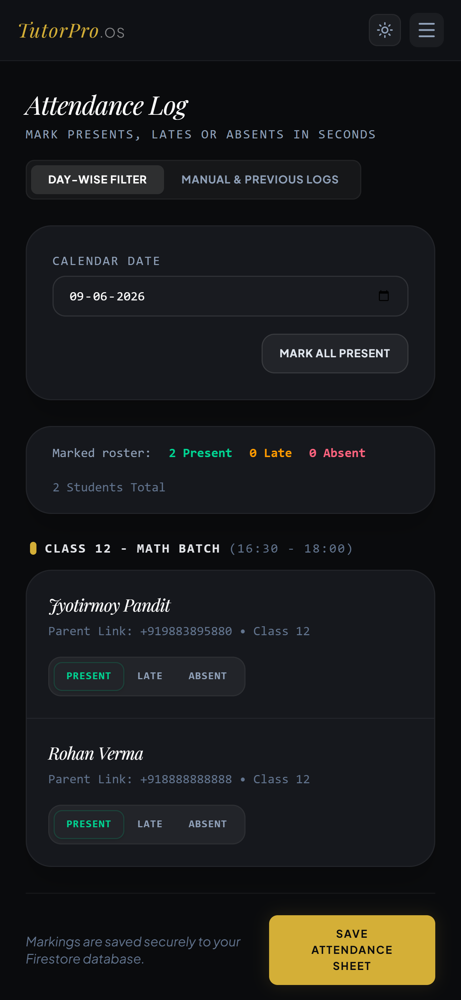
        </div>
        <div style="background: rgba(30, 41, 59, 0.45); border: 1px solid rgba(255, 255, 255, 0.08); border-radius: 12px; padding: 12px; display: flex; flex-direction: column; gap: 6px; min-height: 120px;">
          <div style="display: flex; justify-content: space-between; align-items: center;">
            <span style="font-size: 9px; font-weight: 700; text-transform: uppercase; letter-spacing: 0.05em; padding: 2px 6px; border-radius: 4px; background: rgba(6, 182, 212, 0.15); color: #8be9fd; border: 1px solid rgba(6, 182, 212, 0.2); display: inline-block;">Mobile App</span>
            <span style="font-size: 10px; font-family: monospace; color: #64748b;">Module #07</span>
          </div>
          <h4 style="margin: 0; padding: 0; border: none; font-family: 'Outfit', sans-serif; font-size: 14px; font-weight: 600; color: #f8fafc; background: transparent;">Attendance Manager</h4>
          <p style="margin: 0; padding: 0; border: none; font-size: 11px; color: #94a3b8; line-height: 1.4; background: transparent;">Automated roll call check verification with attendance statistics.</p>
          <div style="display: flex; gap: 4px; flex-wrap: wrap;">
            <span style="font-size: 9px; color: #06b6d4; background: rgba(6, 182, 212, 0.1); padding: 1px 6px; border-radius: 3px; border: 1px solid rgba(6, 182, 212, 0.15); display: inline-block;">#attendance</span>
            <span style="font-size: 9px; color: #06b6d4; background: rgba(6, 182, 212, 0.1); padding: 1px 6px; border-radius: 3px; border: 1px solid rgba(6, 182, 212, 0.15); display: inline-block;">#analytics</span>
          </div>
        </div>
      </div>

      <!-- Slide 8 -->
      <div style="flex: 0 0 100%; scroll-snap-align: start; box-sizing: border-box; display: flex; flex-direction: column; gap: 12px; height: 100%; padding: 10px; text-align: left;">
        <div style="flex-grow: 1; height: 380px; display: flex; align-items: center; justify-content: center; overflow: hidden; border-radius: 12px; border: 1px solid rgba(255, 255, 255, 0.08);">
          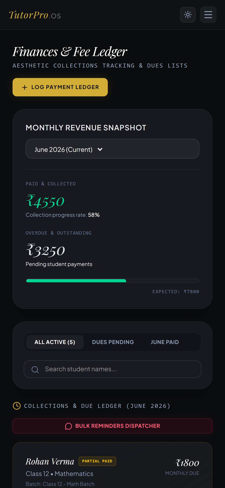
        </div>
        <div style="background: rgba(30, 41, 59, 0.45); border: 1px solid rgba(255, 255, 255, 0.08); border-radius: 12px; padding: 12px; display: flex; flex-direction: column; gap: 6px; min-height: 120px;">
          <div style="display: flex; justify-content: space-between; align-items: center;">
            <span style="font-size: 9px; font-weight: 700; text-transform: uppercase; letter-spacing: 0.05em; padding: 2px 6px; border-radius: 4px; background: rgba(6, 182, 212, 0.15); color: #8be9fd; border: 1px solid rgba(6, 182, 212, 0.2); display: inline-block;">Mobile App</span>
            <span style="font-size: 10px; font-family: monospace; color: #64748b;">Module #08</span>
          </div>
          <h4 style="margin: 0; padding: 0; border: none; font-family: 'Outfit', sans-serif; font-size: 14px; font-weight: 600; color: #f8fafc; background: transparent;">Financial Console</h4>
          <p style="margin: 0; padding: 0; border: none; font-size: 11px; color: #94a3b8; line-height: 1.4; background: transparent;">Fee collection tracking, payment statements, and accounting ledgers.</p>
          <div style="display: flex; gap: 4px; flex-wrap: wrap;">
            <span style="font-size: 9px; color: #06b6d4; background: rgba(6, 182, 212, 0.1); padding: 1px 6px; border-radius: 3px; border: 1px solid rgba(6, 182, 212, 0.15); display: inline-block;">#finances</span>
            <span style="font-size: 9px; color: #06b6d4; background: rgba(6, 182, 212, 0.1); padding: 1px 6px; border-radius: 3px; border: 1px solid rgba(6, 182, 212, 0.15); display: inline-block;">#accounting</span>
          </div>
        </div>
      </div>

      <!-- Slide 9 -->
      <div style="flex: 0 0 100%; scroll-snap-align: start; box-sizing: border-box; display: flex; flex-direction: column; gap: 12px; height: 100%; padding: 10px; text-align: left;">
        <div style="flex-grow: 1; height: 380px; display: flex; align-items: center; justify-content: center; overflow: hidden; border-radius: 12px; border: 1px solid rgba(255, 255, 255, 0.08);">
          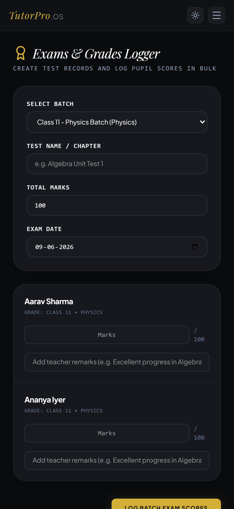
        </div>
        <div style="background: rgba(30, 41, 59, 0.45); border: 1px solid rgba(255, 255, 255, 0.08); border-radius: 12px; padding: 12px; display: flex; flex-direction: column; gap: 6px; min-height: 120px;">
          <div style="display: flex; justify-content: space-between; align-items: center;">
            <span style="font-size: 9px; font-weight: 700; text-transform: uppercase; letter-spacing: 0.05em; padding: 2px 6px; border-radius: 4px; background: rgba(6, 182, 212, 0.15); color: #8be9fd; border: 1px solid rgba(6, 182, 212, 0.2); display: inline-block;">Mobile App</span>
            <span style="font-size: 10px; font-family: monospace; color: #64748b;">Module #09</span>
          </div>
          <h4 style="margin: 0; padding: 0; border: none; font-family: 'Outfit', sans-serif; font-size: 14px; font-weight: 600; color: #f8fafc; background: transparent;">Exams & Grading</h4>
          <p style="margin: 0; padding: 0; border: none; font-size: 11px; color: #94a3b8; line-height: 1.4; background: transparent;">Academic examinations setup, scheduling, and digital report cards.</p>
          <div style="display: flex; gap: 4px; flex-wrap: wrap;">
            <span style="font-size: 9px; color: #06b6d4; background: rgba(6, 182, 212, 0.1); padding: 1px 6px; border-radius: 3px; border: 1px solid rgba(6, 182, 212, 0.15); display: inline-block;">#exams</span>
            <span style="font-size: 9px; color: #06b6d4; background: rgba(6, 182, 212, 0.1); padding: 1px 6px; border-radius: 3px; border: 1px solid rgba(6, 182, 212, 0.15); display: inline-block;">#grades</span>
          </div>
        </div>
      </div>

      <!-- Slide 10 -->
      <div style="flex: 0 0 100%; scroll-snap-align: start; box-sizing: border-box; display: flex; flex-direction: column; gap: 12px; height: 100%; padding: 10px; text-align: left;">
        <div style="flex-grow: 1; height: 380px; display: flex; align-items: center; justify-content: center; overflow: hidden; border-radius: 12px; border: 1px solid rgba(255, 255, 255, 0.08);">
          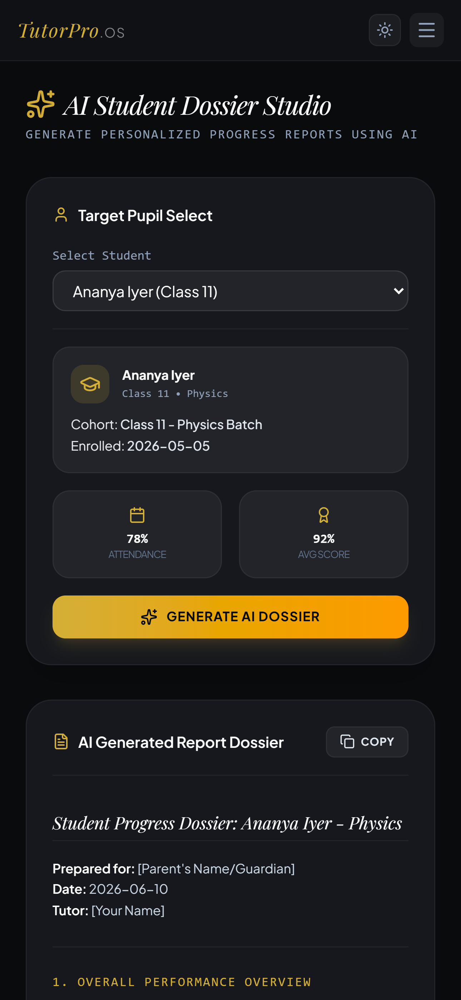
        </div>
        <div style="background: rgba(30, 41, 59, 0.45); border: 1px solid rgba(255, 255, 255, 0.08); border-radius: 12px; padding: 12px; display: flex; flex-direction: column; gap: 6px; min-height: 120px;">
          <div style="display: flex; justify-content: space-between; align-items: center;">
            <span style="font-size: 9px; font-weight: 700; text-transform: uppercase; letter-spacing: 0.05em; padding: 2px 6px; border-radius: 4px; background: rgba(6, 182, 212, 0.15); color: #8be9fd; border: 1px solid rgba(6, 182, 212, 0.2); display: inline-block;">Mobile App</span>
            <span style="font-size: 10px; font-family: monospace; color: #64748b;">Module #10</span>
          </div>
          <h4 style="margin: 0; padding: 0; border: none; font-family: 'Outfit', sans-serif; font-size: 14px; font-weight: 600; color: #f8fafc; background: transparent;">AI Reports Engine</h4>
          <p style="margin: 0; padding: 0; border: none; font-size: 11px; color: #94a3b8; line-height: 1.4; background: transparent;">Automated analysis tool generating student behavioral logs and forecasts.</p>
          <div style="display: flex; gap: 4px; flex-wrap: wrap;">
            <span style="font-size: 9px; color: #06b6d4; background: rgba(6, 182, 212, 0.1); padding: 1px 6px; border-radius: 3px; border: 1px solid rgba(6, 182, 212, 0.15); display: inline-block;">#ai</span>
            <span style="font-size: 9px; color: #06b6d4; background: rgba(6, 182, 212, 0.1); padding: 1px 6px; border-radius: 3px; border: 1px solid rgba(6, 182, 212, 0.15); display: inline-block;">#reports</span>
          </div>
        </div>
      </div>

      <!-- Slide 11 -->
      <div style="flex: 0 0 100%; scroll-snap-align: start; box-sizing: border-box; display: flex; flex-direction: column; gap: 12px; height: 100%; padding: 10px; text-align: left;">
        <div style="flex-grow: 1; height: 380px; display: flex; align-items: center; justify-content: center; overflow: hidden; border-radius: 12px; border: 1px solid rgba(255, 255, 255, 0.08);">
          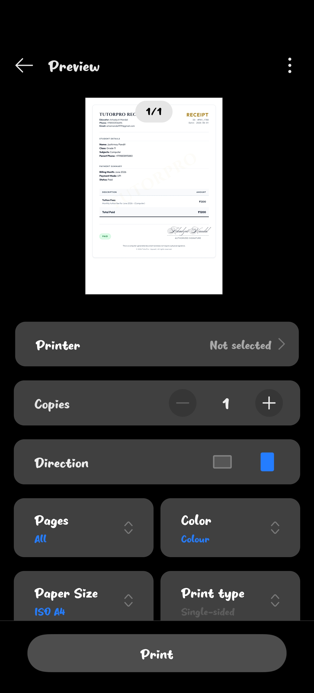
        </div>
        <div style="background: rgba(30, 41, 59, 0.45); border: 1px solid rgba(255, 255, 255, 0.08); border-radius: 12px; padding: 12px; display: flex; flex-direction: column; gap: 6px; min-height: 120px;">
          <div style="display: flex; justify-content: space-between; align-items: center;">
            <span style="font-size: 9px; font-weight: 700; text-transform: uppercase; letter-spacing: 0.05em; padding: 2px 6px; border-radius: 4px; background: rgba(6, 182, 212, 0.15); color: #8be9fd; border: 1px solid rgba(6, 182, 212, 0.2); display: inline-block;">Mobile App</span>
            <span style="font-size: 10px; font-family: monospace; color: #64748b;">Module #11</span>
          </div>
          <h4 style="margin: 0; padding: 0; border: none; font-family: 'Outfit', sans-serif; font-size: 14px; font-weight: 600; color: #f8fafc; background: transparent;">Invoice & Receipting</h4>
          <p style="margin: 0; padding: 0; border: none; font-size: 11px; color: #94a3b8; line-height: 1.4; background: transparent;">Generates receipt logs and downloadable printable invoice PDFs.</p>
          <div style="display: flex; gap: 4px; flex-wrap: wrap;">
            <span style="font-size: 9px; color: #06b6d4; background: rgba(6, 182, 212, 0.1); padding: 1px 6px; border-radius: 3px; border: 1px solid rgba(6, 182, 212, 0.15); display: inline-block;">#invoice</span>
            <span style="font-size: 9px; color: #06b6d4; background: rgba(6, 182, 212, 0.1); padding: 1px 6px; border-radius: 3px; border: 1px solid rgba(6, 182, 212, 0.15); display: inline-block;">#receipt</span>
          </div>
        </div>
      </div>

    </div>
  </div>
</div>

<details>
  <summary>🔍 Click to view individual high-resolution screenshots</summary>
  <br>
  
  ### 🖥️ Desktop Web App Previews
  
  * **01. Secure Google Login Portal**
    
  * **02. Premium Educator Onboarding**
    
  * **03. Command Center Dashboard**
    
  * **04. Batch & Student Directory**
    
  * **05. Student Profile & Transaction Ledger**
    
  * **06. Dossier & Performance Ledger**
    
  * **07. Roll Roster (Attendance)**
    
  * **08. Fee Management & Ledger**
    
  * **09. Exams & Cohort Grades**
    
  * **10. AI Progress Dossier Studio**
    
  * **11. Printed Invoice Sheet**
    

  <br>

  ### 📱 Mobile Companion Previews
  
  * **01. Mobile Login Screen**
    
  * **02. Mobile Tutor Onboarding**
    
  * **03. Mobile Command Dashboard**
    
  * **04. Mobile Batch Lists**
    
  * **05. Mobile Student Profile**
    
  * **06. Mobile Dossier Analytics**
    
  * **07. Mobile Attendance Marker**
    
  * **08. Mobile Fee Accounts**
    
  * **09. Mobile Exam Records**
    
  * **10. Mobile AI Dossier Generation**
    
  * **11. Mobile Invoice Print Sheet**
    
</details>

---

## ⚡ Core Modules

* **Command Center (Dashboard):** A comprehensive summary panel detailing active enrollments, today's batch schedule, monthly revenue metrics, due fees, and batch composition.
* **Student Dossiers:** Create profiles tracking classes, contacts, school, active status, test histories, and fee logs.
* **Roll Roster:** Simple daily attendance marker supporting custom schedules. Includes automatic scheduled day-wise lists, historical database locks, and templates to send late/absent notifications via WhatsApp.
* **Finances (Fee Ledger):** Multi-channel (UPI, Cash, Bank Transfer) fee logging. Tracks outstanding balances, records historical logs, and visualizes payments.
* **Exams & Grade Ledger:** Track exam records. Enter scores batch-wise and chart historical progress charts.
* **Gemini AI Dossiers:** Integrates Gemini models to analyze test performance and attendance rates to compile a formal progress card report.
* **Scroll-to-Top Navigation**: Smooth float button to instantly return to the top header on long list rosters.

---

## 📱 Mobile Companion App

TutorPro.OS is equipped with a native Android WebView wrapper application.

### Key Mobile Capabilities
* **Full Screen Layout**: Removes the browser address bar to maximize space.
* **Back Navigation Hook**: The device back button navigates WebView history rather than exiting the app.
* **Native WhatsApp Routing**: Smart intent resolver handles `whatsapp://` and `wa.me` links, opening them in the official WhatsApp application.
* **DOM Storage**: Supports local storage fallback if network sync is unavailable.

### 📥 Downloading the Mobile App
You can download the compiled installer package directly from the repository's release files:
* **Debug APK**: **[`releases/tutorpro-debug.apk`](./releases/tutorpro-debug.apk)**

---

## 🛠️ Technical Stack & Architecture

- **Web Core**: React 19 + TypeScript
- **Style System**: CSS + Tailwind CSS (v4)
- **Transitions**: Framer Motion
- **Database Syncer**: Firebase Firestore (automatic local-to-cloud migration on user sign-in)
- **AI Core**: Google Gemini 2.0 API (via client-side secure SDK integrations)
- **Build Core**: Vite
- **Mobile Core**: Native Android (Kotlin + Jetpack Compose) hosting Android WebView APIs.

---

## 🚀 Local Development Setup

### Web App
1. Install node dependencies:
   ```bash
   npm install
   ```
2. Configure `.env.local` using the provided template with your Firebase credentials and Gemini API Key:
   ```env
   VITE_FIREBASE_API_KEY="..."
   VITE_FIREBASE_AUTH_DOMAIN="..."
   VITE_FIREBASE_PROJECT_ID="..."
   VITE_FIREBASE_STORAGE_BUCKET="..."
   VITE_FIREBASE_MESSAGING_SENDER_ID="..."
   VITE_FIREBASE_APP_ID="..."
   VITE_ALLOWED_EMAIL="arkamandal1919@gmail.com"
   VITE_GEMINI_API_KEY="AQ.Ab8..."
   ```
3. Run the development server locally:
   ```bash
   npm run dev
   ```
4. Build static distribution bundle for deployment:
   ```bash
   npm run build
   ```

### Mobile App (Android Studio)
1. Ensure the Android SDK and command-line tools are available.
2. Initialize project structures:
   ```bash
   android create empty-activity --name="TutorPro" -o=./android
   ```
3. Open `./android` in Android Studio or compile via gradle:
   ```bash
   cd android
   ./gradlew assembleDebug
   ```
